# Clarifying Requirements

Turn vague requests into precise, actionable requirements through structured dialogue.

This skill sits **between** the user's initial request and any design/brainstorming work. It ensures you understand *what* to build before figuring out *how* to build it.

<HARD-GATE>
Do NOT read any code, make any file changes, invoke brainstorming, writing-plans, or any implementation skill until you have:
1. Restated the request and received user confirmation
2. Asked at least one clarifying question and received an answer

Exploration of files is ONLY allowed AFTER initial clarification. During exploration, do NOT plan implementation — only understand what exists.
This applies to EVERY request, regardless of perceived simplicity or time pressure.
</HARD-GATE>

## Anti-Pattern: "I Know What They Want, No Need To Clarify"

Every request goes through this process. A one-liner, a bug report, a feature ask — all of them. The clarification can be brief (a few questions for truly simple requests), but you MUST go through it and produce a written requirements document.

**CRITICAL: Do NOT read any code or explore the codebase until AFTER you have asked at least one clarifying question and received an answer.** File exploration is for refining your understanding of WHAT exists, not for planning HOW to change it. If you find yourself thinking "I should change X in file Y" during exploration, you have moved too fast.

**Violating the letter of the rules is violating the spirit of the rules.**

## Checklist

You MUST create a task for each of these items and complete them in order:

1. **Restate the request** — paraphrase what you heard, confirm understanding
2. **Ask clarifying questions** — one at a time, understand purpose/constraints/scope/success criteria. MUST ask at least one question before reading any code.
3. **Explore current context** — AFTER initial clarification, check relevant files/docs to refine your understanding
4. **Ask follow-up questions** — use what you found to ask better questions
5. **Identify edge cases** — what happens at boundaries, what's explicitly out of scope
6. **Define success criteria** — how will we know this is done and working correctly
7. **Write requirements doc** — save to `docs/superpowers/requirement/YYYY-MM-DD-<topic>-requirement.md` and commit
8. **Requirements self-review** — quick inline check for placeholders, ambiguity, scope creep (see below)
8b. **Subagent review** — dispatch reviewer subagent, fix any issues found (see below)
9. **User reviews written requirements** — ask user to review before any design work
10. **Transition to brainstorming** — invoke brainstorming skill to explore design approaches

## Process Flow

```dot
digraph clarifying_requirements {
    rankdir=LR;
    "Restate request" [shape=box];
    "Ask clarifying questions" [shape=box];
    "User answered?" [shape=diamond];
    "Explore context" [shape=box];
    "Follow-up questions" [shape=box];
    "Identify edge cases" [shape=box];
    "Define success criteria" [shape=box];
    "Write requirements doc" [shape=box];
    "Self-review" [shape=box];
    "Subagent review?" [shape=diamond];
    "User reviews?" [shape=diamond];
    "Invoke brainstorming" [shape=doublecircle];

    "Restate request" -> "Ask clarifying questions";
    "Ask clarifying questions" -> "User answered?";
    "User answered?" -> "Ask clarifying questions" [label="no, ask more"];
    "User answered?" -> "Explore context" [label="yes, move on"];
    "Explore context" -> "Follow-up questions";
    "Follow-up questions" -> "Identify edge cases";
    "Identify edge cases" -> "Define success criteria";
    "Define success criteria" -> "Write requirements doc";
    "Write requirements doc" -> "Self-review";
    "Self-review" -> "Subagent review?";
    "Subagent review?" -> "Write requirements doc" [label="issues found"];
    "Subagent review?" -> "User reviews?" [label="approved"];
    "User reviews?" -> "Write requirements doc" [label="changes requested"];
    "User reviews?" -> "Invoke brainstorming" [label="approved"];
}
```



**The terminal state is invoking brainstorming.** Do NOT invoke writing-plans or any implementation skill directly. The ONLY next step after clarifying-requirements is brainstorming.

## The Process

**Restating the request:**

- Paraphrase what you understood in your own words
- Ask the user: "Just to make sure I understand — you want X so that Y. Is that right?"
- If the user corrects you, restate again until aligned

**Exploring context:**

- This step happens AFTER initial clarifying questions, not before.
- Check relevant files, docs, recent commits related to the request.
- Understand what currently exists before clarifying what should change.
- If the request touches existing code, understand its current behavior and limitations.
- **Do NOT plan changes during exploration.** If you catch yourself thinking "I should modify X" or "the fix is Y," stop. That is implementation planning, which comes after requirements are clarified.
- **Do NOT make any file changes.** Read-only during this phase.

**Asking clarifying questions:**

- One question at a time — never batch multiple questions into one message
- Prefer multiple choice questions when possible; open-ended is fine when options aren't clear
- Focus on understanding: **purpose** (why), **constraints** (what limits exist), **scope** (what's in/out), **success criteria** (how we know it's done)
- If the request describes multiple independent features, flag this immediately. Don't refine details of a project that needs decomposition first.
- For large requests, help decompose into sub-requirements. Each sub-requirement can get its own clarification cycle.

**Good clarifying question examples:**

```
What problem are you trying to solve? (purpose)
  → "I want to add caching to the API" → "What's motivating this? Latency complaints, cost, something else?"

What constraints exist? (constraints)
  → "We need real-time sync" → "What's the acceptable latency? 100ms? 1s? 10s?"

What's in and out of scope? (scope)
  → "Build a dashboard" → "What should this dashboard show? What should it explicitly NOT show?"

How will we know it's working? (success criteria)
  → "Make it faster" → "What does 'faster' mean? Under what load? What's the target number?"

Who is the user? (audience)
  → "Add an admin panel" → "Who specifically counts as an admin? What permissions do they have?"
```

**Identifying edge cases:**

- What happens at boundaries? (empty input, max input, concurrent access)
- What error conditions matter? (network failure, invalid data, timeouts)
- What's explicitly out of scope? (what should we NOT build even if it seems related)

**Defining success criteria:**

- Concrete, measurable outcomes
- "It works" is not a success criterion
- "API responds in <200ms at p99 under 1000 req/s" is a success criterion

## After Clarification

**Documentation:**

- Write the validated requirements to `docs/superpowers/requirement/YYYY-MM-DD-<topic>-requirement.md`
  - (User preferences for requirement location override this default)
- Use elements-of-style:writing-clearly-and-concisely skill if available
- Commit the requirements document to git

**Requirements Document Structure:**

```markdown
# Requirements: <Topic>

## Background
What problem are we solving and why now?

## Goals
What must this achieve? (numbered, specific, measurable)

## Non-Goals
What are we explicitly NOT doing?

## Scope
What's included and what's excluded?

## Constraints
Technical, business, or time constraints.

## Success Criteria
How do we know this is done and working? (measurable)

## Edge Cases
Known edge cases and how they should be handled.

## Open Questions
Anything still undecided (minimize these).
```

**Requirements Self-Review:**
After writing the requirements document, look at it with fresh eyes:

1. **Placeholder scan:** Any "TBD", "TODO", incomplete sections, or vague requirements? Fix them.
2. **Internal consistency:** Do any sections contradict each other? Do the goals match the success criteria?
3. **Scope check:** Is this focused enough, or does it need decomposition?
4. **Ambiguity check:** Could any requirement be interpreted two different ways? If so, pick one and make it explicit.
5. **Measurability check:** Can each success criterion be verified with a yes/no or a number? If not, make it measurable.

Fix any issues inline. No need to re-review — just fix and move on.

**Subagent Review:**
After the self-review passes, dispatch a requirements reviewer subagent:

> "Requirements written and self-reviewed. Dispatching reviewer subagent for independent check."

Use the prompt template from `requirements-document-reviewer-prompt.md`. Replace `[REQUIREMENTS_FILE_PATH]` with the actual path to the requirements document.

If the reviewer finds issues, fix them inline and re-run the self-review. If the reviewer approves, proceed to user review.

**User Review Gate:**
After the self-review passes, ask the user to review the written requirements before proceeding:

> "Requirements written and committed to `<path>`. Please review and confirm these capture what you want before we move to exploring design approaches."

Wait for the user's response. If they request changes, make them and re-run the self-review. Only proceed once the user approves.

**Implementation:**

- Invoke the brainstorming skill to explore design approaches
- Do NOT invoke any other skill. brainstorming is the next step.

## Key Principles

- **One question at a time** — Don't overwhelm with multiple questions
- **Multiple choice preferred** — Easier to answer than open-ended when possible
- **Focus on WHAT, not HOW** — Requirements describe what to achieve, not how to achieve it
- **Measurable criteria** — Every requirement must be verifiable
- **Explicit non-goals** — What we're NOT building is as important as what we are
- **YAGNI ruthlessly** — Remove unnecessary requirements from scope
- **Be flexible** — Go back and clarify when something doesn't make sense

## Common Mistakes

| Mistake | Fix |
|---------|-----|
| Jumping to solutions | Ask "what problem does this solve?" instead of "which library should we use?" |
| Assuming constraints | Ask about limits explicitly (time, budget, performance) |
| Vague success criteria | Replace "it should work" with specific, measurable outcomes |
| Skipping non-goals | Always define what's out of scope to prevent creep |
| Batching questions | One question per message, always |
| Requirements that prescribe implementation | "The system shall use Redis" → "The system shall cache responses with <50ms latency" |

## Common Rationalizations

| Excuse | Reality |
|--------|---------|
| "I'll explore the code first, then implement" | Exploring is fine, but exploring WITH the intent to implement skips clarification. Explore to understand context, then clarify requirements. |
| "The user is in a hurry / has a meeting / needs this now" | Time pressure is exactly when clarification matters most. A 5-minute clarification saves 30 minutes of wrong implementation. |
| "They expect work to have started" | "Started" means clarifying requirements, not writing code. Clarification IS the first step of work. |
| "I already know what they mean" | You know what you think they mean. Paraphrase and confirm — if you're right, it takes 10 seconds. If you're wrong, it saves hours. |
| "I'll clarify while implementing" | That's not clarification, that's guessing. Clarification happens BEFORE implementation. |
| "This is simple enough, no need to document" | Simple requests often hide complex assumptions. Write the requirements — even if brief. |
| "I'll schedule a deeper discussion later" | There is no "later." Clarify NOW, before any implementation planning. |
| "The real problem is X, not what they asked" | You might be right. But confirm with the user before solving a different problem than they asked for. |
| "I found the problem while reading the code, let me fix it" | Finding a problem is not authorization to fix it. Clarify with the user first. |
| "I have a good idea from exploring, let me propose solutions" | Solutions come after requirements, not during exploration. Ask clarifying questions first. |

## Red Flags - STOP and Start Over

- Reading code before asking any clarifying questions
- Making file changes before the requirements document is written and approved
- "They're in a hurry" as justification to skip clarification
- "I'll ask questions later" or "I'll clarify while building"
- Planning implementation during file exploration
- Writing a plan without a requirements document first
- "The problem is obviously X" without confirming with the user
- "I found the issue, let me fix it" before clarifying scope
- Thinking about WHICH files to change before knowing WHAT to build

**All of these mean: Stop. Restate the request. Ask clarifying questions.**

## Relationship to Other Skills

```
User Request → clarifying-requirements → brainstorming → writing-plans → executing-plans
   (WHAT)           (clarify)            (HOW)         (steps)       (build)
```

- **clarifying-requirements**: What are we building and why? (this skill)
- **brainstorming**: How should we design it? (explores approaches)
- **writing-plans**: What are the implementation steps? (creates task list)
- **executing-plans**: Build it step by step (implementation)

Each skill has a distinct purpose. Don't skip steps.
