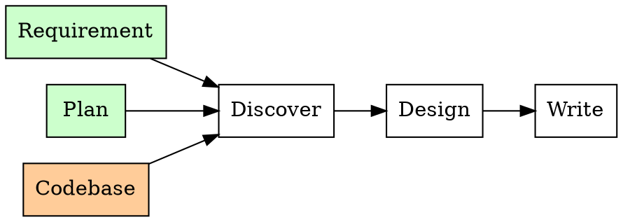

# Writing Architecture

## Overview

Produces architecture design documents from requirements, existing designs, or codebase analysis. Output goes to `docs/superpowers/architectures/`.

**Core principle:** Architecture documents bridge *why* (requirements) and *how* (implementation plans). Show system structure — types, flows, boundaries — not line-by-line implementation.

## When to Use

**Triggers:** requirement doc needs a design, implementation plan lacks architecture context, refactor discussed but undocumented, starting new crate/service/major subsystem.

**Input sources:**
- `docs/superpowers/requirement/*.md` — requirement documents
- `docs/superpowers/plans/*.md` — implementation plans
- `docs/superpowers/specs/*.md` — existing design specs
- Codebase analysis — grep for key types, read existing structs

**Not for:** small bug fixes, UI changes, API-only updates.

## Workflow



### Phase 1: Discover

Read all available inputs — requirement goals/non-goals/constraints, plan task breakdown, and relevant code. Understand current state and desired state.

### Phase 2: Design

Structure around these dimensions:

| Dimension | Cover |
|-----------|-------|
| Requirements | Link doc or summarize goals + non-goals |
| System diagram | ASCII art with real type names, data flow arrows |
| Crate/file structure | Directory tree with new and modified files |
| Key types and APIs | Real Rust structs, traits, signatures with doc comments |
| Data flow | Step-by-step for primary and secondary operations |
| Edge cases | Table from requirements, how each is handled |
| Out of scope | What this architecture deliberately does NOT cover |
| Testing strategy | Unit vs integration level coverage |

### Phase 3: Write

Create at `docs/superpowers/architectures/{YYYY-MM-DD}-{slug}.md`:

```
# Architecture: {Title}

**Date**: YYYY-MM-DD
**Status**: Draft | Approved | Implemented
**Author**: {name}
**Source**: Requirement doc (path) | Plan (path) | Codebase analysis

## Requirements

Link to requirement doc or summarize goals and non-goals.

## Architecture

High-level description (2-3 sentences).

    ASCII system diagram here

### Component Breakdown

#### 1. Component Name
Purpose, responsibilities, key decisions.

### Crate / File Structure

    path/to/
    ├── file.rs    # purpose
    └── mod.rs     # purpose

## Key Types

### `TypeName`
```rust
// actual code with doc comments
```

## Data Flow

### Primary Flow: {name}
Step-by-step or sequence diagram.

## Edge Cases

| Edge Case | Behavior |
|-----------|----------|
| ... | ... |

## Out of Scope

- What this architecture does NOT cover

## Testing Strategy

- Unit tests: what to test
- Integration tests: what scenarios
```

## Quick Checklist

- [ ] Requirements section links to source or summarizes goals + non-goals
- [ ] System diagram uses real type names, shows data flow direction
- [ ] Key types are real Rust code with doc comments (not pseudocode)
- [ ] Data flow covers at least the primary operation path
- [ ] Edge case table from requirements is addressed in design
- [ ] Out of scope section prevents scope creep
- [ ] Filename: `docs/superpowers/architectures/YYYY-MM-DD-slug.md`

## Common Mistakes

| Mistake | Fix |
|---------|-----|
| Re-writing requirement content verbatim | Link to requirements, summarize instead |
| Pseudocode instead of real Rust types | Show actual structs, traits, enums |
| No system diagram or too abstract | Use concrete component names from code |
| Missing edge case handling | Carry edge cases from requirements into architecture |
| Including implementation details | Show interfaces only, implementation goes in the plan |
| No out-of-scope section | Define boundaries to prevent scope creep |
| Wrong output directory | Always `docs/superpowers/architectures/` |

## Context

In this project, requirements say *what/why*, plans say *which steps*, and architecture says *how it's structured*. Without architecture docs, engineers jump from requirements to implementation, missing edge cases and creating inconsistent types.
